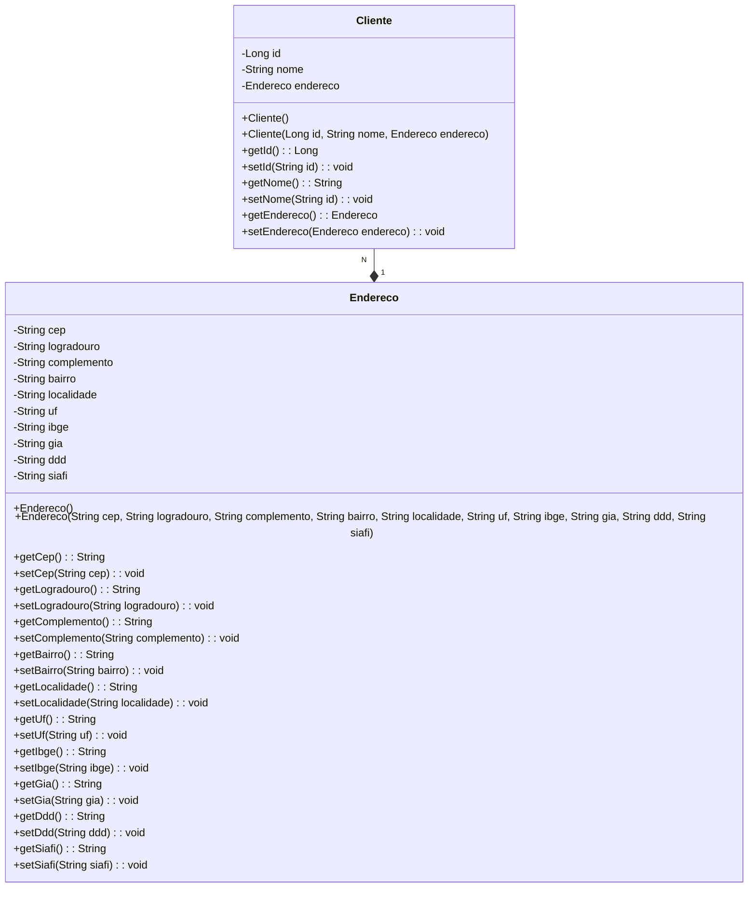

# Springboot API of Costumer

API RESTFul of Costumer using Springboot and integrated with ViaCEP API

```mermaid
classDiagram
    class Cliente{
      -Long id
      -String nome
      -Endereco endereco

      +Cliente()
      +Cliente(Long id, String nome, Endereco endereco)
      +getId(): Long
      +setId(String id): void
      +getNome(): String
      +setNome(String id): void
      +getEndereco(): Endereco
      +setEndereco(Endereco endereco): void
    }
    class Endereco{
      -String cep
      -String logradouro
      -String complemento
      -String bairro
      -String localidade
      -String uf
      -String ibge
      -String gia
      -String ddd
      -String siafi

      +Endereco()
      +Endereco(String cep, String logradouro, String complemento, String bairro, String localidade, String uf, String ibge, String gia, String ddd, String siafi)
      +getCep(): String
      +setCep(String cep): void
      +getLogradouro(): String
      +setLogradouro(String logradouro): void
      +getComplemento(): String
      +setComplemento(String complemento): void
      +getBairro(): String
      +setBairro(String bairro): void
      +getLocalidade(): String
      +setLocalidade(String localidade): void
      +getUf(): String
      +setUf(String uf): void
      +getIbge(): String
      +setIbge(String ibge): void
      +getGia(): String
      +setGia(String gia): void
      +getDdd(): String
      +setDdd(String ddd): void
      +getSiafi(): String
      +setSiafi(String siafi): void
    }

    Cliente "N" --* "1" Endereco 
    
```
